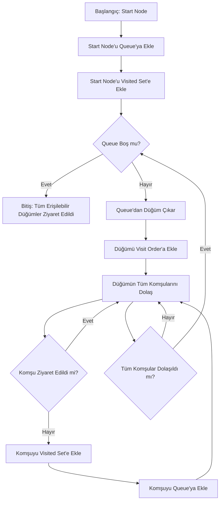
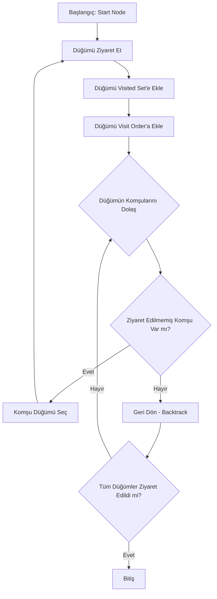
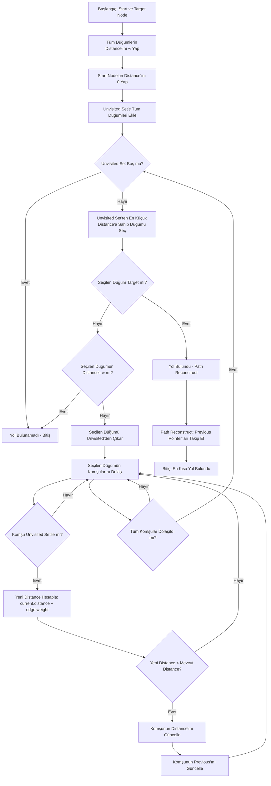
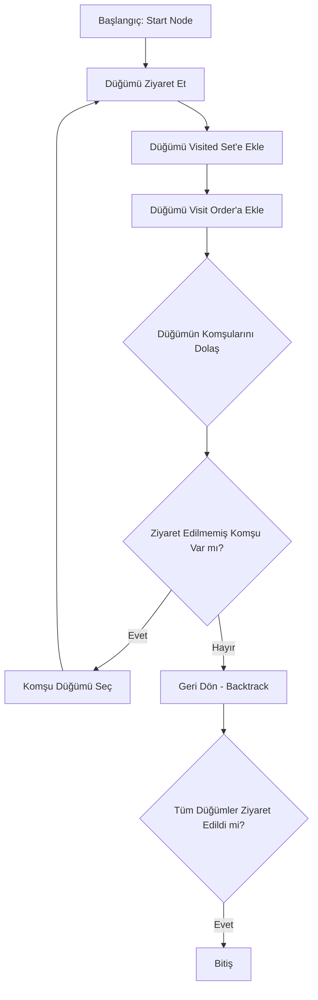
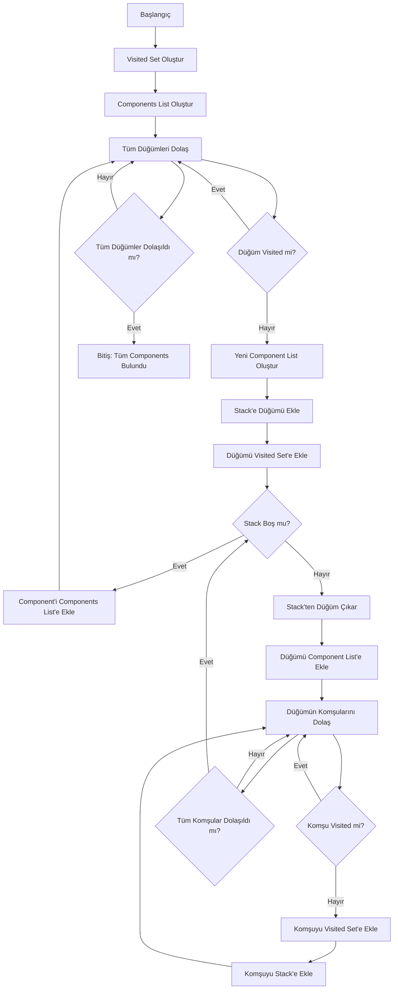
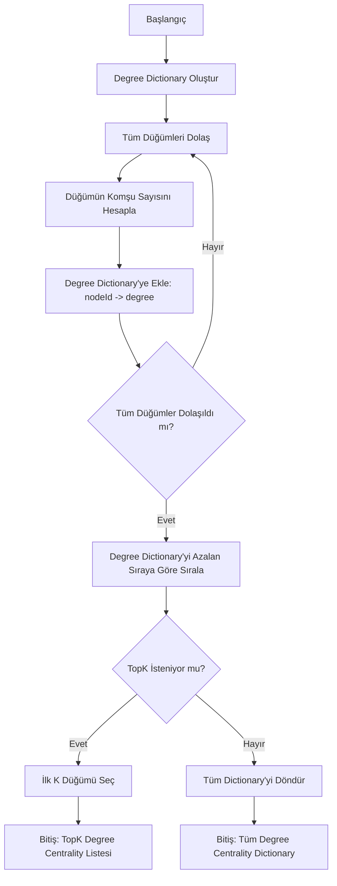
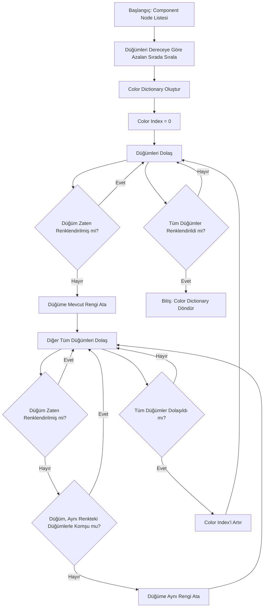
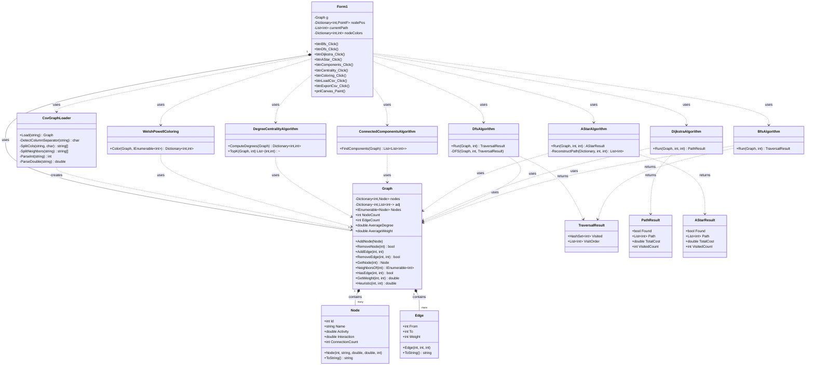

# AkaNet
**Sosyal Ağ Analizi Uygulaması**

## 👥 Ekip Üyeleri
- Oğuzhan Atılkan  
- Mehmet Morgül  

## 📅 Tarih
2 Ocak 2026

---

## 1. Giriş (Problem Tanımı ve Amaç)

Günümüzde sosyal ağlar, ulaşım sistemleri, bilgisayar ağları ve bilgi akışı gibi birçok problem **graf (graph)** veri yapıları ile modellenmektedir. Bu projede, kullanıcılar ve onların bağlantılarını bir graf veri yapısı ile modelleyen, çeşitli algoritmalar çalıştıran ve görselleştirme ile sonuçları sunan bir **Sosyal Ağ Analizi Uygulaması** geliştirilmiştir.

**AkaNet** projesi;  
- Graf tabanlı verileri görsel olarak oluşturmayı,  
- Düğümler (node) ve bağlantılar (edge) arası ilişkileri analiz etmeyi,  
- Klasik ve sezgisel algoritmalarla yol bulmayı,  
- Graf istatistiklerini ve topluluk yapılarını kullanıcıya sunmayı,  
- Dinamik ağırlık hesaplaması ile benzer özelliklere sahip düğümler arasındaki bağlantıları vurgulamayı  

hedefleyen bir Windows Forms uygulamasıdır.

Projenin temel amacı, öğrencilerin graf yapıları, algoritmalar, nesne yönelimli tasarım, görselleştirme ve yazılım geliştirme süreci konularını uygulamalı olarak öğrenmeleridir.

---

## 2. Projede Gerçeklenen Algoritmalar

Bu projede aşağıdaki algoritmalar gerçeklenmiştir:

- **BFS (Breadth First Search)** - Genişlik Öncelikli Arama
- **DFS (Depth First Search)** - Derinlik Öncelikli Arama
- **Dijkstra** - En Kısa Yol Algoritması
- **A* (A Star)** - Sezgisel En Kısa Yol Algoritması
- **Connected Components** - Bağlı Bileşenler Tespiti
- **Degree Centrality** - Merkezilik Analizi
- **Welsh-Powell Graph Coloring** - Graf Renklendirme

---

### 2.1 Breadth First Search (BFS)

**Çalışma Mantığı:**  
BFS, graf üzerinde genişlik öncelikli arama yapan bir algoritmadır. Başlangıç düğümünden itibaren tüm komşular ziyaret edilir, ardından bir sonraki seviye düğümlere geçilir. Bu yaklaşım, başlangıç düğümünden en kısa mesafedeki düğümlere öncelik verir.

**Kullanım Alanları:**  
- En kısa yol bulma (ağırlıksız graflar için)
- Seviye tabanlı aramalar
- Sosyal ağlarda bağlantı seviyesi analizi
- Ağ topolojisi keşfi

**Zaman Karmaşıklığı:**  
- **O(V + E)** - V: düğüm sayısı, E: kenar sayısı

**Uzay Karmaşıklığı:**  
- **O(V)** - Queue için gerekli alan

**Literatür İncelemesi:**  
BFS algoritması, 1959 yılında Edward F. Moore tarafından labirent çözme problemi için önerilmiştir. Algoritma, graf teorisinde temel bir arama stratejisi olarak kabul edilir ve birçok algoritmanın temelini oluşturur.

**Akış Diyagramı (Mermaid):**


---

### 2.2 Depth First Search (DFS)

**Çalışma Mantığı:**  
DFS, bir dal boyunca mümkün olduğunca derine inen, çıkmaz sokağa ulaştığında geri dönen (backtracking) bir algoritmadır. Stack veri yapısı veya özyineleme (recursion) kullanılarak gerçeklenebilir.

**Kullanım Alanları:**  
- Topolojik sıralama
- Döngü tespiti
- Bağlı bileşenler bulma
- Maze çözme problemleri

**Zaman Karmaşıklığı:**  
- **O(V + E)** - V: düğüm sayısı, E: kenar sayısı

**Uzay Karmaşıklığı:**  
- **O(V)** - Recursion stack veya explicit stack için

**Literatür İncelemesi:**  
DFS algoritması, 19. yüzyıldan beri bilinen bir kavramdır ve Charles Pierre Trémaux tarafından labirent çözme için kullanılmıştır. Modern bilgisayar biliminde, John Hopcroft ve Robert Tarjan tarafından 1970'lerde formalize edilmiştir.

**Akış Diyagramı (Mermaid):**


---

### 2.3 Dijkstra Algoritması

**Çalışma Mantığı:**  
Dijkstra algoritması, başlangıç düğümünden tüm diğer düğümlere olan en kısa yolları bulan bir algoritmadır. Greedy (açgözlü) yaklaşım kullanır ve her adımda en düşük maliyetli düğümü seçer. Negatif ağırlıklı kenarlar için çalışmaz.

**Kullanım Alanları:**  
- En kısa yol bulma
- Rota planlama
- Ağ routing protokolleri
- Sosyal ağlarda en kısa bağlantı analizi

**Zaman Karmaşıklığı:**  
- **O(V² + E)** - Basit implementasyon (array-based)
- **O((V + E) log V)** - Priority queue kullanıldığında (heap-based)

**Uzay Karmaşıklığı:**  
- **O(V)** - Distance ve previous dizileri için

**Literatür İncelemesi:**  
Algoritma, 1956 yılında Edsger W. Dijkstra tarafından geliştirilmiştir. Bilgisayar biliminde en yaygın kullanılan en kısa yol algoritmasıdır ve birçok modern algoritmanın temelini oluşturur.

**Akış Diyagramı (Mermaid):**


---

### 2.4 A* (A Star) Algoritması

**Çalışma Mantığı:**  
A* algoritması, Dijkstra algoritmasının sezgisel (heuristic) bilgi kullanarak geliştirilmiş halidir. Her düğüm için f(n) = g(n) + h(n) değerini hesaplar; burada g(n) başlangıçtan düğüme olan gerçek maliyet, h(n) ise düğümden hedefe olan tahmini maliyettir. Heuristic fonksiyonu admissible (kabul edilebilir) olmalıdır.

**Kullanım Alanları:**  
- Oyunlarda pathfinding
- Robotik navigasyon
- Harita uygulamaları
- Optimizasyon problemleri

**Zaman Karmaşıklığı:**  
- **O(b^d)** - En kötü durum (b: branching factor, d: depth)
- Pratikte Dijkstra'dan daha hızlıdır çünkü hedefe yönelik arama yapar

**Uzay Karmaşıklığı:**  
- **O(b^d)** - Açık düğümler için priority queue

**Literatür İncelemesi:**  
A* algoritması, 1968 yılında Peter Hart, Nils Nilsson ve Bertram Raphael tarafından geliştirilmiştir. AI ve oyun geliştirmede en yaygın kullanılan pathfinding algoritmasıdır.

**Akış Diyagramı (Mermaid):**


---

### 2.5 Connected Components (Bağlı Bileşenler)

**Çalışma Mantığı:**  
Bağlı bileşenler algoritması, graf içindeki birbirinden bağımsız alt grafları bulur. Her bileşen, içindeki tüm düğümlerin birbirine ulaşılabilir olduğu maksimal düğüm kümesidir. DFS veya BFS kullanılarak gerçeklenebilir.

**Kullanım Alanları:**  
- Sosyal ağlarda topluluk tespiti
- Ağ bağlantı analizi
- Graf bölümleme
- İzole edilmiş grupların bulunması

**Zaman Karmaşıklığı:**  
- **O(V + E)** - Her düğüm ve kenar bir kez ziyaret edilir

**Uzay Karmaşıklığı:**  
- **O(V)** - Visited set ve stack için

**Literatür İncelemesi:**  
Bağlı bileşenler problemi, graf teorisinin temel problemlerinden biridir. Modern algoritmalar, DFS tabanlı yaklaşımlar kullanır ve O(V + E) zaman karmaşıklığına sahiptir.

**Akış Diyagramı (Mermaid):**


---

### 2.6 Degree Centrality (Merkezilik Analizi)

**Çalışma Mantığı:**  
Degree Centrality, bir düğümün önemini, sahip olduğu bağlantı sayısına (derece) göre ölçer. Sosyal ağlarda, yüksek dereceye sahip düğümler genellikle daha etkili veya merkezi konumda olan kullanıcıları temsil eder.

**Kullanım Alanları:**  
- Sosyal ağlarda etkili kullanıcı tespiti
- Ağ topolojisi analizi
- Hub düğümlerin belirlenmesi
- Influencer analizi

**Zaman Karmaşıklığı:**  
- **O(V + E)** - Her düğüm ve kenar bir kez işlenir

**Uzay Karmaşıklığı:**  
- **O(V)** - Degree dictionary için

**Literatür İncelemesi:**  
Degree Centrality, sosyal ağ analizinde en basit ve en yaygın kullanılan merkezilik ölçüsüdür. Linton Freeman tarafından 1979'da formalize edilmiştir ve sosyal ağ analizinin temel metriklerinden biridir.

**Akış Diyagramı (Mermaid):**


---

### 2.7 Welsh-Powell Graph Coloring

**Çalışma Mantığı:**  
Welsh-Powell algoritması, bir grafın düğümlerini, komşu düğümlerin farklı renklere sahip olması koşuluyla renklendiren bir algoritmadır. Düğümler derecelerine göre azalan sırada sıralanır ve her düğüm, komşularından farklı olan en küçük rengi alır.

**Kullanım Alanları:**  
- Zamanlama problemleri
- Kaynak tahsisi
- Register allocation (derleyici optimizasyonu)
- Frekans atama (telekomünikasyon)

**Zaman Karmaşıklığı:**  
- **O(V² + E)** - V: düğüm sayısı, E: kenar sayısı

**Uzay Karmaşıklığı:**  
- **O(V)** - Color dictionary için

**Literatür İncelemesi:**  
Welsh-Powell algoritması, 1967 yılında D. J. A. Welsh ve M. B. Powell tarafından geliştirilmiştir. Graf renklendirme probleminde kullanılan en yaygın greedy algoritmalardan biridir.

**Akış Diyagramı (Mermaid):**


---

## 3. Projenin Sınıf Yapısı ve Modüller

Proje, nesne yönelimli programlama prensiplerine uygun olarak modüler bir yapıda tasarlanmıştır. Aşağıda sınıf diyagramı ve modül açıklamaları yer almaktadır.

### 3.1 Sınıf Diyagramı (Mermaid)



### 3.2 Modül Açıklamaları

#### 3.2.1 Models Modülü

**Node Sınıfı:**  
Graf düğümlerini temsil eder. Her düğüm, ID, isim ve üç sayısal özellik (Activity, Interaction, ConnectionCount) içerir. Bu özellikler, dinamik ağırlık hesaplamasında kullanılır.

**Edge Sınıfı:**  
Graf kenarlarını temsil eder. İki düğüm arasındaki bağlantıyı gösterir. Self-loop kontrolü yapılır.

**Graph Sınıfı:**  
Graf veri yapısını yönetir. Düğüm ve kenar ekleme/silme işlemlerini sağlar. Dinamik ağırlık hesaplama formülünü içerir:
```
Ağırlık(i,j) = 1 / (1 + (Activity_i - Activity_j)² + (Interaction_i - Interaction_j)² + (ConnectionCount_i - ConnectionCount_j)²)
```
Ayrıca A* algoritması için heuristic fonksiyonu sağlar.

#### 3.2.2 Algorithms Modülü

Tüm algoritmalar ayrı sınıflar halinde modüler olarak tasarlanmıştır:

- **BfsAlgorithm:** BFS algoritmasını gerçekler
- **DfsAlgorithm:** DFS algoritmasını gerçekler
- **DijkstraAlgorithm:** Dijkstra en kısa yol algoritmasını gerçekler
- **AStarAlgorithm:** A* algoritmasını gerçekler
- **ConnectedComponentsAlgorithm:** Bağlı bileşenleri bulur
- **DegreeCentralityAlgorithm:** Merkezilik analizi yapar
- **WelshPowellColoring:** Graf renklendirme yapar

#### 3.2.3 Data Modülü

**CsvGraphLoader:**  
CSV dosyalarından graf verilerini yükler. Format:
```
DugumId;Aktivite;Etkilesim;BaglantiSayisi;Komsular
1;0.8;12;3;2|4|5
```

#### 3.2.4 Results Modülü

**TraversalResult:** BFS ve DFS algoritmalarının sonuçlarını tutar.  
**PathResult:** Dijkstra algoritmasının sonuçlarını tutar.  
**AStarResult:** A* algoritmasının sonuçlarını tutar.

#### 3.2.5 UI Modülü (Form1)

Windows Forms tabanlı kullanıcı arayüzü. Graf görselleştirme, algoritma çalıştırma, düğüm/kenar yönetimi gibi işlevleri sağlar.

---

## 4. Dinamik Ağırlık Hesaplama

Uygulamada, düğümler arasındaki bağlantıların ağırlıkları dinamik olarak hesaplanmaktadır. Her düğüm, üç sayısal özelliğe sahiptir:
- **Activity (Aktiflik):** Düğümün aktivite seviyesi
- **Interaction (Etkileşim):** Düğümün etkileşim sayısı
- **ConnectionCount (Bağlantı Sayısı):** Düğümün toplam bağlantı sayısı

İki düğüm (i ve j) arasındaki ağırlık değeri şu formül ile hesaplanır:

```
Ağırlık(i,j) = 1 / (1 + (Activity_i - Activity_j)² + (Interaction_i - Interaction_j)² + (ConnectionCount_i - ConnectionCount_j)²)
```

**Formülün Mantığı:**
- Benzer özelliklere sahip düğümler arasındaki uzaklık küçük olacağından, ağırlık değeri yüksek olur (daha yakın, daha güçlü bağlantı).
- Farklı özelliklere sahip düğümler arasındaki uzaklık arttıkça, ağırlık değeri azalır (daha uzak, daha zayıf bağlantı).
- Hesaplanan ağırlık değerleri, Dijkstra ve A* gibi tüm yol bulma algoritmalarında kenar maliyeti olarak kullanılır.

---

## 5. Uygulama Açıklamaları ve Sonuçlar

### 5.1 Uygulama Özellikleri

**Graf İşlemleri:**
- Düğüm ekleme, silme, güncelleme
- Bağlantı (edge) ekleme, silme
- Graf görselleştirme (canvas üzerinde)
- Düğüm sürükle-bırak ile konumlandırma
- Shift + tıklama ile bağlantı oluşturma
- Sağ tıklama ile düğüm/kenar silme

**Algoritma Çalıştırma:**
- Her algoritma ayrı buton ile tetiklenir
- Sonuçlar hem görsel (canvas üzerinde renklendirme/yol gösterimi) hem de tablo (listbox) formatında gösterilir
- Dijkstra ve A* için animasyonlu yol gösterimi
- Algoritma çalışma süreleri ve ziyaret edilen düğüm sayıları gösterilir

**Veri Yönetimi:**
- CSV formatında veri içe/dışa aktarımı
- Komşuluk listesi otomatik oluşturulur
- Graf istatistikleri (düğüm sayısı, kenar sayısı, ortalama derece, ortalama ağırlık) gösterilir


### 5.2 Ekran Görüntüleri


1. **Ana Ekran:** Graf görselleştirmesi, algoritma butonları, düğüm yönetim paneli
2. **BFS/DFS Sonuçları:** Ziyaret sırası listesi
3. **Dijkstra/A* Sonuçları:** Bulunan yol, maliyet bilgisi, animasyonlu gösterim
4. **Bağlı Bileşenler:** Bileşen listesi
5. **Merkezilik Analizi:** Top 5 düğüm tablosu
6. **Renklendirme:** Renklendirilmiş graf görseli
7. **CSV İçe/Dışa Aktarım:** Dosya seçim diyalogları

---

## 6. Sonuç ve Tartışma

### 6.1 Başarılar

1. **Nesne Yönelimli Tasarım:** Proje, SOLID prensiplerine uygun olarak modüler bir yapıda geliştirilmiştir. Her algoritma ayrı bir sınıf olarak gerçeklenmiş, kod tekrarı minimize edilmiştir.

2. **Algoritma Gerçeklemesi:** Tüm istenen algoritmalar başarıyla gerçeklenmiş ve test edilmiştir. Algoritmalar, küçük ve orta ölçekli graflarda makul sürelerde çalışmaktadır.

3. **Dinamik Ağırlık Hesaplama:** Formül başarıyla uygulanmış ve tüm yol bulma algoritmalarında kullanılmıştır. Benzer özelliklere sahip düğümler arasındaki bağlantılar daha yüksek ağırlık değerine sahiptir.

4. **Görselleştirme:** Graf, canvas üzerinde etkileşimli olarak gösterilmektedir. Algoritma sonuçları hem görsel hem de tablo formatında sunulmaktadır.

5. **Veri Yönetimi:** CSV formatında veri içe/dışa aktarımı başarıyla gerçeklenmiştir. Komşuluk listesi otomatik olarak oluşturulmaktadır.

6. **Hata Yönetimi:** Self-loop, duplicate node gibi hatalı durumlar uygun şekilde engellenmiştir.

### 6.2 Sınırlılıklar

1. **Ölçeklenebilirlik:** Çok büyük graflarda (1000+ düğüm) performans sorunları yaşanabilir. Özellikle görselleştirme kısmında optimizasyon gerekebilir.

2. **Görselleştirme:** Düğümlerin otomatik yerleşimi basit bir dairesel düzen kullanmaktadır. Daha gelişmiş yerleşim algoritmaları (force-directed, hierarchical) eklenebilir.

3. **Algoritma Optimizasyonu:** Dijkstra algoritması basit bir array-based implementasyon kullanmaktadır. Priority queue (heap) kullanılarak O((V+E)logV) zaman karmaşıklığına ulaşılabilir.

4. **Veri Formatı:** Şu an sadece CSV formatı desteklenmektedir. JSON formatı da eklenebilir.

5. **Renklendirme:** Welsh-Powell algoritması optimal renk sayısını garanti etmez. Daha gelişmiş renklendirme algoritmaları kullanılabilir.

### 6.3 Olası Geliştirmeler

1. **Performans İyileştirmeleri:**
   - Dijkstra için heap-based priority queue implementasyonu
   - Büyük graflar için görselleştirme optimizasyonu (level-of-detail)
   - Paralel algoritma çalıştırma desteği

2. **Yeni Algoritmalar:**
   - Betweenness Centrality
   - Closeness Centrality
   - PageRank
   - Minimum Spanning Tree (Kruskal, Prim)
   - Topological Sort

3. **Görselleştirme İyileştirmeleri:**
   - Force-directed graph layout
   - Zoom ve pan özellikleri
   - Düğüm/kenar özelleştirme (renk, boyut, etiket)
   - Animasyonlu algoritma adımları

4. **Veri Yönetimi:**
   - JSON format desteği
   - Veritabanı entegrasyonu
   - Online veri kaynaklarından graf yükleme

5. **Kullanıcı Deneyimi:**
   - Algoritma parametrelerini ayarlama (ör. A* için heuristic ağırlığı)
   - Sonuçları dosyaya kaydetme
   - Graf istatistiklerini detaylı raporlama
   - Çoklu graf karşılaştırma

6. **Test ve Kalite:**
   - Unit testler
   - Integration testler
   - Performans benchmark'ları

### 6.4 Öğrenilenler

Bu proje sürecinde:
- Graf veri yapıları ve algoritmaları hakkında derinlemesine bilgi edinildi
- Nesne yönelimli programlama prensipleri uygulandı
- Windows Forms ile görsel programlama deneyimi kazanıldı
- Algoritma karmaşıklık analizi yapıldı
- Yazılım geliştirme süreci (tasarım, kodlama, test) uygulandı
- Ekip çalışması ve versiyon kontrolü (GitHub) deneyimi kazanıldı

---

## 7. Kaynaklar ve Referanslar

1. Cormen, T. H., Leiserson, C. E., Rivest, R. L., & Stein, C. (2009). *Introduction to Algorithms* (3rd ed.). MIT Press.

2. Dijkstra, E. W. (1959). A note on two problems in connexion with graphs. *Numerische Mathematik*, 1(1), 269-271.

3. Hart, P. E., Nilsson, N. J., & Raphael, B. (1968). A formal basis for the heuristic determination of minimum cost paths. *IEEE Transactions on Systems Science and Cybernetics*, 4(2), 100-107.

4. Welsh, D. J. A., & Powell, M. B. (1967). An upper bound for the chromatic number of a graph and its application to timetabling problems. *The Computer Journal*, 10(1), 85-86.

5. Freeman, L. C. (1979). Centrality in social networks conceptual clarification. *Social Networks*, 1(3), 215-239.

6. Moore, E. F. (1959). The shortest path through a maze. *Proceedings of the International Symposium on the Theory of Switching*, 285-292.

---

## 8. Ekler

### 8.1 Kullanılan Teknolojiler

- **Programlama Dili:** C#
- **Framework:** .NET Framework (Windows Forms)
- **IDE:** Visual Studio
- **Versiyon Kontrolü:** Git, GitHub
- **Dokümantasyon:** Markdown, Mermaid

### 8.2 Proje Yapısı

```
AkaNet/
├── Algorithms/          # Algoritma sınıfları
├── Data/               # Veri yükleme sınıfları
├── Models/             # Graf model sınıfları
├── Results/            # Sonuç sınıfları
├── Services/           # Yardımcı servisler
├── Form1.cs            # Ana UI formu
└── README.md           # Proje dokümantasyonu
```

### 8.3 Kullanım Kılavuzu

1. **Graf Oluşturma:**
   - "Add Node" butonu ile düğüm ekleyin
   - Düğüm özelliklerini (Activity, Interaction, ConnectionCount) doldurun
   - Shift + tıklama ile düğümler arası bağlantı oluşturun

2. **Algoritma Çalıştırma:**
   - Başlangıç ve hedef düğümleri seçin (Dijkstra ve A* için)
   - İlgili algoritma butonuna tıklayın
   - Sonuçları listbox'ta ve canvas'ta görüntüleyin

3. **Veri Yönetimi:**
   - "Load CSV" ile mevcut graf yükleyin
   - "Export CSV" ile grafı kaydedin

---

**Proje Tamamlanma Tarihi:** 2 Ocak 2026  
**Versiyon:** 1.0  
**Lisans:** Eğitim Amaçlı
